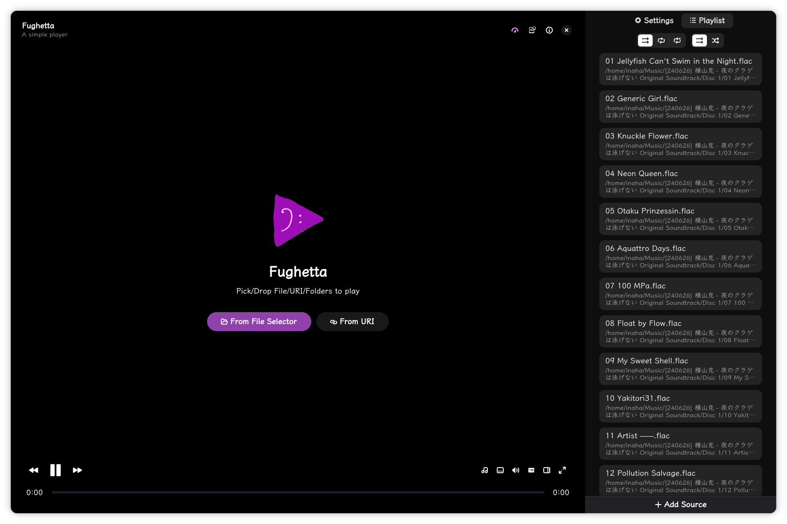
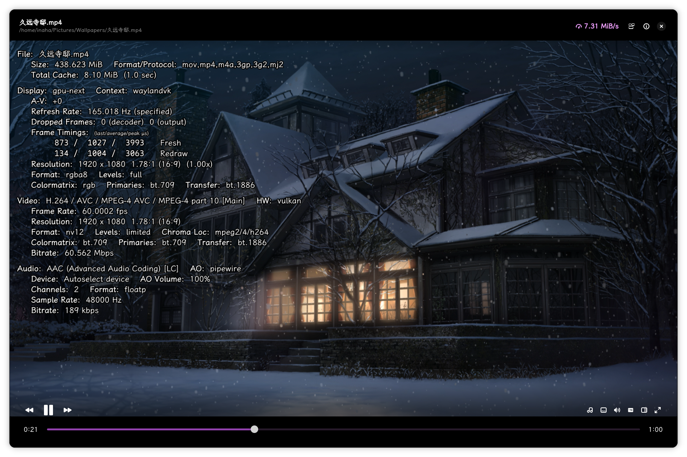

## Fughetta

A GTK4 frontend for MPV, embedded by wl-proxy, written in Rust.

### Screenshots

### Playing media
We have 4 ways to open media files:

1. Use args, e.g. `fughetta example.mp4`
1. Drag and drop files/URLs/folders to the window or playlist
1. Use the "Open" button to select files, folders or URLs
1. Open a file from your file manager with the "Open with" context menu

### Roadmap

If this project earns enough traction, the following features will be implemented:

- [ ] Configuration persistence
- [ ] History session management
- [ ] MPRIS
- [ ] I18n
